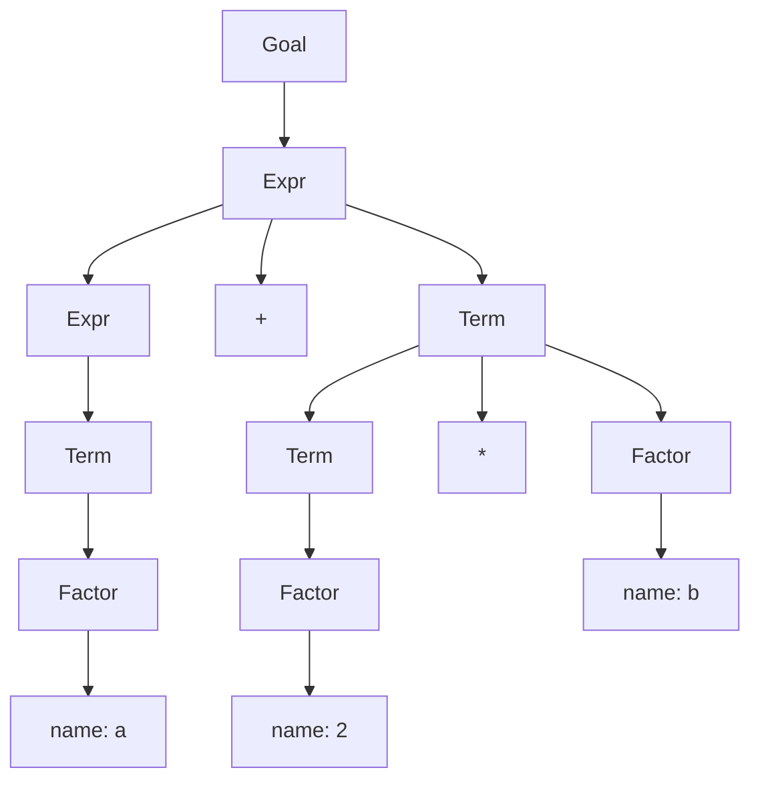
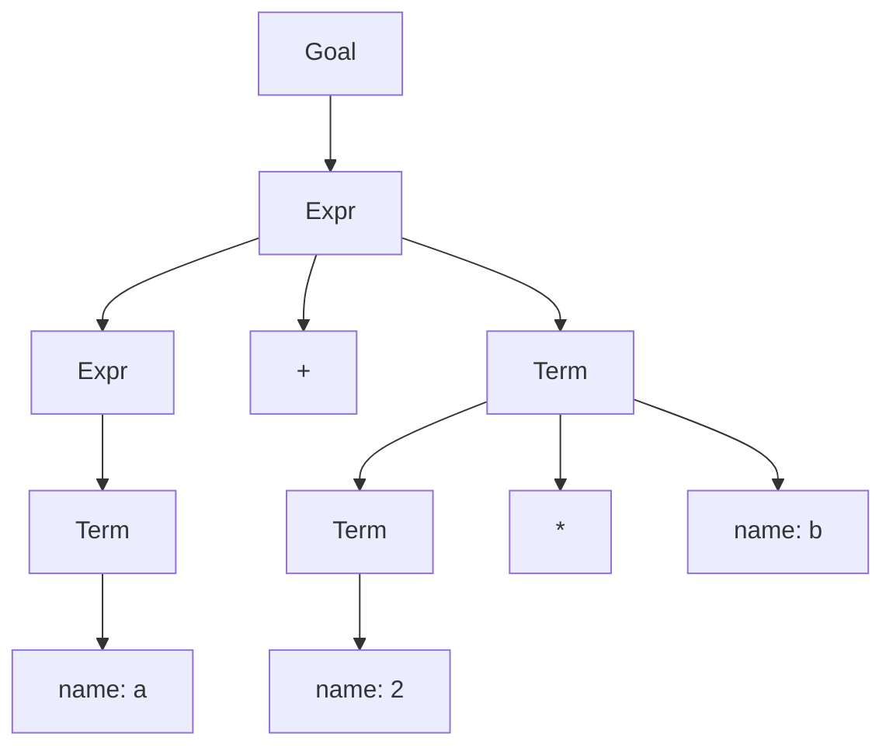

<!--more-->
## 1. 降低语法分析树高度

{}
优化语法无法改变语法分析器的渐进行为，因为输入流中的每个符号在语法分析树中都需要有对应叶节点（事实上，某些分隔符没有）。但对语法中大量使用的部分（如表达式语法），减小渐进时间估算中的常数系数，仍然可以产生足够的差异。
{}

考虑下面的经典表达式语法：

```c
Goal -> Expr
Expr -> Expr + Term
      | Expr - Term
      | Term
Term -> Term * Factor
      | Term / Factor
      | Factor
Factor -> '(' Expr ')'
        | num
        | name
```

为实施**优先级规则**，增加了两个非终结符 `Term` 和 `Factor`。这样一来，即使对于非常简单的表达式 `a + 2 * b`，语法分析树也相当大。

{}
[](https://mermaid.live/edit#pako:eNpN0D0PgjAQBuC_Qm5UWRw7mCgfgrrpZMtwQhUS2hIsicb4330NGp3unst7l7QPKl2lSdCl564ODrGyS7l23BZhuFjJ5Nb1hbIrIPrHdCyxPOjeYBYByRcJkMqUS-_e-RRcS8tGi4DhGM6-2TcmY8l_Kxm4-XEDbj8X5nAO7z4-FTQjg2PcVHjGQ9kgUORrbbQigbbSZx5ar0jZJ6I8eLe_25KE7wc9o6Gr2Ou4YXyAIXHm9oppx_bonBlDzxcsomAC)
{}



任何**只有一个子节点的内部节点**都是优化的对象。我们通过修改 `Term` 的规则，至少可以消除一层。

- 新产生式

```c
Term -> Term * '(' Expr ')'
      | Term * name
      | Term * num
      | Term / '(' Expr ')'
      | Term / name
      | Term / num
      | '(' Expr ')'
      | name
      | num
```

- 新语法分析树

{}
[](https://mermaid.live/edit#pako:eNpNzz0PgjAQBuC_Qm5UWBw7mMhHJNFNJluGkxYhoR-pJdEQ_rtngMTp7nn7DtcJGisVMHh6dF1U5cKc-NniUCfJMeXF2_lamJSQ_WO_jJxXymvKMkKxoSCcuUGtWITknFxujz_shClpXNbOYY2vqx81xKCpjr2kyyZhokhA6JRWAhitUrU4DkGAMDNVcQz29jENsOBHFcPoJAaV90h_0sBaHF6UOjR3a_VSmr-GD1Dl)
{}



一般来说，右侧句型只包含任何一个非终结符的产生式，都是可以折叠起来的，这种产生式称为“**无用产生式**”。

有时，无用产生式有自身的作用：使得语法更**紧凑**或更具**可读性**。编译器编写者加入一个无用产生式，可能只是在推导中创建一个点，以便在该点执行某个特定操作。

## 2. 减小 LR(1) 表的规模

### 合并行或列

1. 合并完全相同的行或列
2. 如果两行/列的不相同之处是**其中一列为空白**，合并这样的行/列，语法分析对于正确输入仍然会产生正确行为，但**改变了错误输入下的行为**。

### 缩减语法

合并终结符：

```c
Goal -> Expr
Expr -> Expr addsub Term
      | Term
Term -> Term muldiv Factor
      | Factor
Factor -> '(' Expr ')'
        | val
```

### 表的直接编码

放弃表驱动的语法分析器框架，采用硬编码实现：每个状态都变为一个小的 **case** 语句，或者一组 **if-then-else** 语句。

由此产生的语法分析器，避免了直接表示 **Action** 和 **Goto** 表中的“不关注”表项，但这种对内存空间的节省，可能**被增加的代码长度抵消**，因为每个状态包含更多的代码。

### 使用其它构造算法

{}
任何具有 **LR(1)** 语法的语言，同样有 **LALR(1)** 语法和 **SLR(1)** 语法。
{}

规范的 LR(1) 构造法是这些表构造算法中最通用的，它产生的表最大。

## 参考资料

［1］ Keith D. Cooper. Linda Torczon. 郭旭 译.《编译器设计（第2版）》[M].北京：人民邮电出版社，2020，111-116.